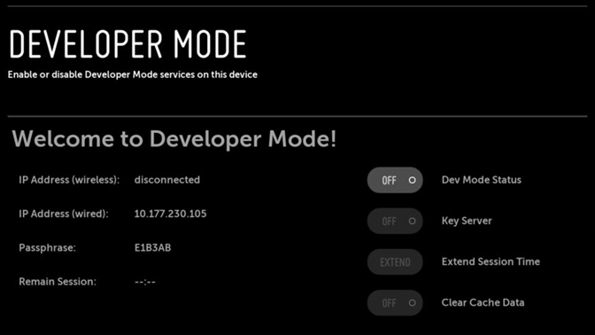

## INTRODUÇÃO

Toda vez que preciso acessar algum site utilizando **um navegador recém instalado** ou no computador de outra pessoa vem o choque: **anúncios pra todos os lados**.

Eu utilizo bloqueadores de anúncio em meus navegadores há tanto tempo que nem lembro quando comecei. 

**Também me esqueço de como é usar a internet "no pelo"**, sem nenhuma salvaguarda contra o mar de poluição 
visual e invasão de privacidade que são os anúncios e *trackers* de redes sociais.

Lá pelos começo dos anos 2010 saber sobre bloqueadores de propaganda e maneiras de burlar paywalls não era um assunto de nicho. Mesmo pessoas pouco versadas nos meandros mais técnicos da internet tinham em mente que havia essas opções.

Porém recentemente vejo que a grande maioria das pessoas, principalmente das gerações mais novas, não sabe como fazer isso ou nem mesmo sequer sabe da possibilidade de poder recorrer às mais diversas ferramentas que a comunidade cria para mitigar propagandas on-line,

## PARA QUEM É ESTE GUIA

Aqui não tem segredo, acredito que ninguém goste conscientemente de ver ou assistir anúncios e propagandas ou ter que pagar para acessar serviços simples e básicos. **Então se você quer despoluir um pouco sua navegação, tanto no PC quanto no mobile e TV, esse guia é pra você.**

## AVISOS IMPORTANTES ⚠️

1. **Como sempre, este não é, não será e nem pretende ser um guia definitivo sobre o assunto.** Para tudo que eu relatar aqui podem haver outras maneiras, mais fáceis ou mais complexas de serem feitas. **==BUSQUEM CONHECIMENTO==**.
2. **Alguns dos métodos e tutoriais que eu descrevo nesse guia eu não pude testar pessoalmente** e estou levando em conta a fonte publicada. **==ENTÃO SIGA POR SUA CONTA E RISCO==**.
3. Para algumas das dicas escritas aqui **você vai precisar de um computador ou notebook**. Seja para realizar algum download ou para instalar um programa que irá acessar sua TV, por exemplo. Então já fique esperto. 


## COMPUTADOR 🖥️

Essa provavelmente é a parte mais simples e fácil, com pouca configuração você já vai poder desfrutar de menos tranqueira na sua navegação.

Algumas coisas daqui **eu vou literalmente copiar** do **[Guia incompleto da Pirataria](https://millenial-idoso.vercel.app/posts/guia-incompleto-de-pirataria-para-millenials-idosos/#prepara%C3%A7%C3%A3o)**, então se você ainda não leu, dá uma conferia lá também pois tem bastante coisa útil.

### NAVEGADOR e EXTENSÕES 🌐

**Resposta curta para todos os sistemas:** **[Firefox](https://www.firefox.com/pt-BR/?utm_campaign=SET_DEFAULT_BROWSER)** + **[uBlock Origin](https://addons.mozilla.org/pt-BR/firefox/addon/ublock-origin/)** (com um navegador Chromium de backup como o **[Vivaldi](https://vivaldi.com/pt-br/download/)** ou o Ungoogled Chromium também com o [uBlock Origin](tab:https://chromewebstore.google.com/detail/ublock-origin-lite/ddkjiahejlhfcafbddmgiahcphecmpfh?hl=pt-BR&pli=1))

> Links para o Ungoogle Chromium: [Linux](https://github.com/ungoogled-software/ungoogled-chromium) • [Windows](https://github.com/ungoogled-software/ungoogled-chromium-windows/releases) • [Mac](https://github.com/ungoogled-software/ungoogled-chromium-macos/releases)

**Resposta longa:** Recentemente o Google vem numa cruzada ferrenha contra bloqueadores de anúncios.

O Chrome, navegador mais popular do mercado, que pertence ao gigante das buscas, sofreu várias atualizações que fizeram extensões de bloqueio de anúncios pararem de funcionar ou não terem mais a mesma eficácia de antes. Quem quiser se aprofundar mais [procure sobre a atualização do Manifest v2 para v3](tab:https://plus.diolinux.com.br/t/conhecendo-um-pouco-mais-sobre-o-manifest-v2-e-v3/67794).

No mercado de navegadores hoje **existem basicamente três linhas a seguir**: Chrome, Firefox ou Safari.

Digo isso pois tudo que não é **Firefox —** ou seus derivados, como o Zen, Librewolf, Waterfox, etc — e **Safari,** é baseado em **Chromium**. Chrome, Edge, Brave, Arc, Vivaldi e companhia, por baixo do capô, [são tudo Chromium](tab:https://en.wikipedia.org/wiki/Chromium_\(web_browser\)).

Alguns navegadores baseados em Chromium ainda resistem às mudanças do Google, como o Brave por exemplo, **[porém eu pessoalmente não tenho muita simpatia pelo Brave pelos motivos que você pode ler aqui](tab:https://www.reddit.com/r/browsers/comments/1j1pq7b/list_of_brave_browser_controversies/)**, mas o consenso geral pelos entusiastas é de que o Firefox ainda é o navegador mais “livre” e com melhor proteção de privacidade que temos. Se você quiser dar mais atenção à questões relacionadas a privacidade em sua navegação, alguns *forks* do Firefox como o [Librewolf](tab:https://librewolf.net/) e o [Mullvad](tab:https://mullvad.net/en/browser), por exemplo, são feitos exatamente com isso em mente, mas sempre vale dar aquela pesquisada e conferir o que lhe cai melhor.

**Aviso quanto ao Firefox**: Como o Google avançou firme no mercado de navegadores, o browser da raposa perdeu muito da sua base de usuários nos últimos anos, o que gerou um movimento de alguns desenvolvedores web otimizarem seus sites apenas para navegadores baseados em *Chromium,* acarretando em algumas páginas que não funcionam corretamente na raposinha. **É raro, mas é uma possibilidade**. Por isso, **vale ter um navegador Chromium secundário** instalado para usar nos sites que não carreguem certo no Firefox. Atualmente eu utilizo o Vivaldi como secundário e recomendo bastante. Use qualquer um da sua preferência, mas se puder evitar Chrome e Edge, é o ideal.

**E se você tem um Mac e quer fugir completamente de Firefox ou Chromium**, também pode tentar o **[Orion Browser](https://orionbrowser.com/)** que é baseado no Safari[^1]. Uma coisa legal do Orion é que ele aceita tanto extenções do Chrome quanto do Firefox. **Então nesse caso, você pode usar o uBlock Origin da loja do Firefox, que é o mais completo**.

Quanto às extensões, o **uBlock Origin** é o melhor bloqueador de anúncios e outras porcarias que podem pular na sua cara ao visitar certos sites. Caso você não saiba, ele **também bloqueia propagandas no Youtube**, então se você assiste vídeos majoritariamente pelo navegador do computador, ele vai te salvar de ter que assinar o Premium.

Nas configurações do uBlock Origin, **vale ativar algumas opções extras para a sua navegação ficar limpinha e cheirosa**:

==Clique no ícone da extensão, depois no ícone das engrenagens ⚙️ para abrir a página de configurações dele.==

**Nesta página, troque para a aba "Listas de filtros" e habilite as seguintes opções:**


> [!TIP]
> **BÔNUS**: Caso você seja obrigado a entrar na fossa a céu aberto que é o site conhecido como **Linkedin**, vale adicionar os filtros personalizados abaixo para tirar os posts "promovidos" do feed.

Troque para a aba "Meus filtros", copie o texto a seguir e cole no campo de código disponível no uBlock. Depois basta clicar em "Aplicar mudanças":

```txt
linkedin.com##li:has-text(Promoted)
linkedin.com##:xpath('//\*[(text()[contains(.,"Promoted")])]/../../../../../../../../../..')
linkedin.com##:xpath('//\*[(text()[contains(.,"Promovido")])]/../../../../../../../../..')
linkedin.com##:xpath('//\*[(text()[contains(.,"Promovida")])]/../../../../../../../../..')
linkedin.com##:xpath('//\*[(text()[contains(.,"Promoção pela empresa")])]/../../../../../../../../..')
```

> [!WARNING]
> Esse filtro **pode quebrar a parte de Vagas do Linkedin**, então lembre de desativar o uBlock nessa página se estiver procurando emprego.

**Aqui cabe um aviso:** Há uma pequena chance do uBlock **quebrar** **alguns sites**. Isso acontece porque ele bloqueia determinados elementos das páginas web que podem ter características usadas nos anúncios. Portanto, tenha sempre em mente que quando algum site parecer não estar carregando corretamente, **pode ser o uBlock sendo rigoroso demais**. Nesse caso é só desabilitar a extensão temporariamente para o site em questão, clicando no ícone do uBlock e depois no ícone de desligar. Recarregue a página e veja se tudo funciona.

Além disso, você também **já pode deixá-lo desabilitado de antemão para sites mais "sensíveis" como os do governo (gov.br e Detran por exemplo)** ou internet banking, pois alguma funcionalidade ou pop-upzinho essencial para navegação pode acabar sendo bloqueado sem que você saiba.

Se quiser adicionar outras extensões, aí é da sua preferência. Mas **não utilize mais de um bloqueador de anúncios ao mesmo tempo**. É uma redundância desnecessária que pode causar alguns conflitos e atrapalhar sua navegação. Depois faço outro post com extensões úteis. Me cobrem também.

#### ADICIONANDO BLOQUEIOS PERSONALIZADOS

O uBlock usa uma lista de bloqueio de anúncios pré-determinada pelos *devs*. Só ela já vai bastar para 99% dos casos, **mas pode ser que você tropece em algum anúncio que a extensão não barre**. Caso isso aconteça você pode bloqueá-lo manualmente.

Basta clicar **com o botão direito do mouse em cima do anúncio / banner / pop-up** e depois ir em "Bloquear elemento…". Você verá que o anúncio ficará com uma camada rosa por cima e uma janelinha do uBlock vai aparecer no canto **inferior direito da tela**.

Se o elemento certo estiver marcado em rosa, basta clicar em "Criar" para que ele desapareça. Caso você **não tenha selecionado a parte correta do site**, clique em "Escolher". O mouse irá se tornar uma cruzinha e você poderá selecionar exatamente o que quer bloquear. Uma vez escolhido o elemento correto, clique em "Criar".

**No caso de pop-ups, muitas vezes além do elemento principal eles também deixam um *overlay* gigante por trás**, que te impede de clicar em qualquer coisa. Basta repetir o processo, clicando com o botão direito e em "Bloquear elemento…". Dessa vez clique em qualquer parte do site e você perceberá que tudo fica rosa. É o overlay transparente. Depois só clicar em "Criar" e pronto.

#### VÍDEOS 🎥

Como eu citei lá em cima, o próprio uBlock Origin **bloqueia anúncios no Youtube**. Tanto os que passam antes como os que passam durante o vídeo. Assim como ele também limpa os banners da home e lateral do site.

Se quiser ir além, **também há uma forma de pular o *jabá* que o youtuber possa fazer em seu vídeo**.

Basta instalar a extensão **Sponsor Block** - [Firefox](https://addons.mozilla.org/en-US/firefox/addon/sponsorblock/) ou [Chrome](https://chromewebstore.google.com/detail/sponsorblock-for-youtube/mnjggcdmjocbbbhaepdhchncahnbgone).

Após instalar você poderá **configurar o que quer pular automaticamente** nos vídeos. Por padrão ele pula os *mechans*, mas você também pode escolher dar um *auto skip* em recapitulações, piadinhas que não tenham a ver com o tema, pedidos de like entre outras coisas.

> *=="Mas como isso é possível?"==*

Ele funciona por meio de *crowdsource*. **Ou seja, os próprios usuários marcam onde está cada trecho no vídeo**.

Por exemplo: você está vendo um vídeo que alguém já marcou que aos 1 minuto e 15 segundos tem um anúncio. Você verá que na barra de progresso **o trecho ficou verde**. Quando a reprodução chegar nessa parte o vídeo vai pular sozinho para o fim da propaganda.

Como a ferramenta funciona por inclusão manual dos usuários então **nem todo vídeo vai ter essa artimanha**. Para vídeos de criadores mais famosos é quase certo que alguém já fez a boa e marcou o trecho.

Se você está vendo um vídeo que tenha o *merchan* mas ninguém ainda catalogou, você mesmo pode *tagear* o trecho e enviar para a base de dados da extensão. É um processo bem simples que você faz ali mesmo no player do Youtube.

#### PAYWALLS 📰
**Resposta curta:** [aqui](https://pirataria.link/ferramentas#%E2%96%BA-burladores-de-paywall), e [aqui](https://fmhy.net/internet-tools#paywall-bypass)

**Resposta longa:** Existem vários serviços em que você pode colar o link da notícia que quer ler e eles removem o *paywall*. Mas vale lembrar que sem mais nem menos qualquer um deles pode ser tirado do ar, então vale sempre saber **onde procurar**.

Vou deixar aqui alguns links dos mais relevantes:
- [Marreta](https://marreta.link/)
- [Remove Paywall](https://www.removepaywall.com/)
- [Bye bye paywall](https://byebyepaywall.com/en/)
- [RemovePaywalls](https://removepaywalls.com/)
- [Paywall Buster](https://paywallbuster.com/)
- [Press Released](https://pressreleased.alwaysdata.net/)

Pra quem usa Firefox, o **modo leitura** nativo do navegador também pode ajudar a burlar o paywall e mostrar a notícia completa. **Ele fica localizado na barra de endereços**. Geralmente todos os navegadores baseados na raposa também tem essa opção.

### DISCORD 📢
**Resposta curta**: [aqui](https://fmhy.net/social-media-tools#discord-tools)

**Resposta longa**: Não aguenta mais o Discord enchendo o seu saco pedindo pra você assinar o Nitro? Então seus problemas acabaram.

Existem alguns plugins e versões modificadas do instalador que ajudam com isso e mais uma série de outras coisas. 

A extensão é o **[Vencord](https://vencord.dev/)** e a versão modificada é o **[Vesktop](https://vesktop.dev/install/)**.

**O Vencord é um plugin que você instala por cima do Discord**. Ele vai adicionar uma série de funcionalidades e melhorias. No menu de opções você terá a oportunidade de desligar os avisos do Nitro, modificar drasticamente como as mensagens aparecem, habilitar recursos beta e **até habilitar um bloqueador de anúncios do Youtube dentro do Discord**. Ou seja, se você der play em um vídeo incorporado em uma mensagem ou se você quiser usar o recurso de assistir vídeos com outras pessoas, você não verá nenhuma propaganda.

Mas deixando claro que ele só vai bloquear o anúncio **no seu computador**, se as outras pessoas não tiverem o Vencord instalado verão a propaganda normalmente. 

O **Vesktop** é basicamente um instalador do Discord que já vem com o Vencord embutido, então você não vai precisar fazer mais nada.

Se quiser explorar **mais opções de modificação e até tentar usar outros clientes de Discord**, [nesse link da megathread do r/freemediaheckyeah](https://fmhy.net/social-media-tools#discord-tools) você encontra uma seleção especial de ferramentas interessantes.

### SISTEMA OPERACIONAL 👩‍💻

**Essa parte envolve um pouco mais de conhecimento de informática**, então se não for a sua praia, pode pular para outras sessões, mas caso você realmente se incomode com seu sistema operacional te mandando propaganda e comendo recursos da sua máquina sem você fazer nada, então pode valer a pena a leitura.

É inegável que **usuários do Windows** vem sofrendo nos últimos anos com todas as tranqueiras que a Microsoft vem enfiando no sistema. Desde a ascensão das IAs generativas a empresa do senhor Gates parece se empenhar em empurrar as mais inúteis *features* e aplicativos desde a instalação do SO. Isso sem falar em apps de demonstração e propaganda que já vem pré-instalados.

Para muitos, o fim do suporte ao Windows 10 foi a gota d'água para mudar de sistema de vez. **Então talvez você também devesse considerar essa opção**.

> *=="Ai lá vem o chato recomendar Linux!"==* 😮‍💨

Sim, o chato vai recomendar que você use Linux, mas calma! Também vou te dar uma opção de como ***desmerdificar*** o Windows daqui a pouco. Segura aí.

Eu sei que o sistema do pinguim tem vários estigmas, de ser difícil de usar, de não ter programas compatíveis, de não rodar jogos e outras coisas mais. **Mas grande parte disso já não é mais verdade há uns bons anos.**

Não vou escrever muito sobre, pois ainda pretendo fazer um artigo só sobre como é migrar pra um sistema operacional novo.

Meu ponto aqui é, se você é um usuário padrão, mesmo que com pouco conhecimento *nos compiuter* você ainda pode tirar muito proveito do Linux.

**Se você basicamente só usa computador para:**
- Navegar na internet
- Assistir vídeos no Youtube ou streamings
- Editar documentos básicos de texto ou planilhas
- Ouvir música
- Conversar com amigos via Discord ou outro comunicador

**Você já pode sim mudar de sistema operacional sem nenhum prejuízo**. Tudo que precisa para essas atividades você poderá fazer — as vezes até de forma melhor — no Linux.

**Agora se você precisa de programas específicos como:**
- Pacote ou qualquer aplicação individual da Adobe
- Algum programa de produção gráfica, visual ou sonora que só exista para Windows
- Pacote Office original
- OneDrive

Então você ainda vai ter que ficar refém do Tio Gates, mas nada que um *dual boot* não possa resolver. Claro, se você tiver conhecimento de como executar.

Pra não enrolar muito, **caso você esteja disposto a partir pro pinguim** vou recomendar essas distribuições:

- [Zorin](https://zorin.com/os/)
- [Mint](https://www.linuxmint.com/)
- [Ubuntu](https://ubuntu.com/download)
- [Pop!_Os](https://system76.com/pop/)

> *=="Faltou a distro XYZ…"==*
>
> Calma amigão, são só sugestões. Se quiser, deixe a sua distro favorita nos comentários.

**Obviamente que existem trocentas outras *distros***, mas começar com qualquer uma dessas é o ideal para você ir se acostumando à casa nova.

#### DESMERDIFICANDO O WINDOWS 🪟 💩

Quem manja um pouco talvez já tenha ouvido falar do processo de *debloat / uncrap / decrap*. **São mudanças, *tweaks*, e artimanhas que você pode fazer para retirar ou desabilitar softwares desnecessários e recursos intrusivos do sistema**. E como sabemos, coisa inútil é o que não falta no Windows 11.

Para tirar as tralhas do Windows 11, existem algumas maneiras já conhecidas como o **[Win11Debloat](https://github.com/Raphire/Win11Debloat)** e o **[Windows 11 Debloater](https://windowsdebloater.com/)**. Basta **ler e seguir as instruções** nos respectivos sites para dar uma limpada no seu sistema.

Outra alternativa que vai te ajudar a deixar o Win11 magrinho **desde a instalação** é o script **[autounnatended](https://schneegans.de/windows/unattend-generator/)**. **Essa opção já é bem mais complexa, então recomendo seguir algum tutorial se for fazer**, [como esse aqui do ET](https://www.youtube.com/watch?v=kQM-iv7TQz0&list=WL&index=61), por exemplo.


## MOBILE 📱

Aqui, obviamente, vai depender do sistema que você utiliza. Para a turma do Android a vida é mais fácil — [ao menos por enquanto, já que o Google está planejando dificultar as coisas](https://keepandroidopen.org/pt-BR/) —, já para quem tem o celular da Maçã, as coisas não são tão simples, mas ainda há esperança.

### iOS 🍎

Como a Apple impõe várias travas e limitações de desenvolvimento, vai ser muito mais difícil você achar aplicativos que sejam *versões hackeadas* dos oficiais, porém sem propagandas.

Caso você tenha um iPhone bem mais antigo ainda em uso, e já esteja sofrendo na mão da **obsolescência programada**, talvez seja a hora de [considerar um jailbreak](https://www.imypass.com/pt/unlock-ios/jailbreak-iphone/). Faz muito tempo que fiz um, mas lembro de conseguir implementar coisas bem legias na época. Leia as instruções com atenção e como sempre, **busque conhecimento** sobre o processo e se ele realmente vai funcionar em seu modelo de aparelho.

#### Bloqueio de anúncios no sistema todo

Primeiro, você pode tentar esse **[método para bloquear anúncios no sistema todo](https://rentry.co/system-wide-adblocking-for-ios)**. Basta seguir as instruções no site.

Basicamente ele vai criar um arquivinho de configuração, como se fosse uma VPN particular. Esse arquivo vai fazer com que o **telefone utilize [DNS](https://pt.wikipedia.org/wiki/Sistema_de_Nomes_de_Dom%C3%ADnio)s personalizados que bloqueiam vários tipo de anúncios.**

Eu já testei esse método uma vez e funciona razoavelmente. Mesmo ele atacando direto no DNS, que em tese faria tudo que o celular puxa da internet ser filtrado, o iPhone permite que alguns apps façam *bypass* do DNS. O que acarreta em anúncios sendo mostrados mesmo assim. De qualquer maneira, vale a tentativa.

**Isso pode ajudar em anúncios dentro de jogos e outros aplicativos**, mas se não me engano não é muito eficaz na navegação na web.

#### Navegador

Para bloquear anúncios na navegação convencional via navegador a melhor opção que testei até agora é instalar a **[extensão do uBLock Origin Lite](https://apps.apple.com/br/app/ublock-origin-lite/id6745342698)** para o Safari.

Basta realizar o download pela Appstore mesmo e depois ir nos **Ajustes → Apps → Safari, role para baixo até Extensões. Ative o uBlock.**

Pronto, agora ele funcionará assim como a extensão de navegador. Por ser a versão Lite, **ele tem as mesmas limitações que a versão de Chrome**, como citei lá em cima, mas no geral já vai limpar grande parte das tranqueiras que você encontrará corriqueiramente. Abra um site de notícias e teste para ver.

Se você não curte o Safari, a única outra opção seria **[instalar o Orion Browser](https://apps.apple.com/br/app/orion-browser-by-kagi/id1484498200)**. Assim como sua versão desktop, ele também permite que você adicione extensões do Chrome ou Firefox, e assim como na outra, você pode instalar o uBLock Origin **do Firefox**.

Uma vez que você tenha o bloqueador de anúncios instalado no navegador, **praticamente tudo que tenha versão web poderá ser desfrutado sem nenhum anúncio**.

Instagram, Facebook, Youtube, X (Twitter), Reddit, Pinterest, etc. **Tudo que tenha versão *web mobile* vai abrir sem nenhum anúncio**. Porém essas versões não fornecem a melhor das experiências de usuário, tenha isso em mente.

Se isso não te incomodar, você pode deixar ainda mais prático, criando um favorito das redes que costuma acessar no próprio navegador, ou ainda criando um atalho na tela inicial, que ficará aparecendo como um aplicativo.

Para fazer isso, utilizando o Safari,  basta acessar o site desejado, clicar e segurar na barrinha de endereços até o submenu aparecer, nele clique em **compartilhar**. Depois, no outro submenu, clique em **ver mais**. O resto das opções rolará para cima, selecione **"Adicionar à Tela de Início"**. Em seguida você poderá escolher o nome do atalho e o mais importante: **desmarque a opção "Abrir como web app"**.

**Se você não desmarcar essa opção o iPhone irá criar um  *applet* da página que você favoritou**. A página abrirá numa espécie de navegador encapsulado próprio, só para aquele site. O problema é que esse *applet* faz o *bypass* que eu comentei mais acima, ignorando o DNS e extensões instaladas no seu navegador, fazendo com que as propagandas apareçam novamente. Pois é, Apple sendo Apple.

Se você desmarcar, a página vira um atalho comum na sua Tela de Início, e toda vez que você clicar, **ele abrirá o Safari ou o navegador padrão já no site selecionado.**

**Se você tem TOC, já vou deixar avisado que nem todos os ícones ficam bonitinhos. É a vida…**

Estou utilizando o Reddit por esse método há alguns meses e, apesar da UX não ser das melhores, nunca mais vi nenhum anúncio na timeline.


#### Youtube

Como eu disse na seção anterior, dá pra assistir Youtube pelo navegador, sem anúncios. Mas, novamente, a experiência pode não ser das melhores.

Por isso, para assistir conteúdos no site de vídeos mais famoso da web de maneira mais confortável, você pode utilizar um **[app chamado Tube Pip](https://apps.apple.com/us/app/tube-pip-pip-for-youtube/id6476895094)**. 

Ao abri-lo você verá que ele possui várias opções de acesso dentro: Youtube, Instagram, Twitch, Reddit, dentre outros. **De todos esses somente o Youtube é mostrado como "otimizado", os outros aparecem como "Navegador".**

Isso porque ele abre o Youtube nativamente, dentro do app, **sem anúncios**. Já os outros sites ele vai abrir num navegador interno próprio, mas como disse anteriormente, em alguns casos os apps burlam o DNS do telefone (e até mesmo da sua rede toda) e mostram anúncios mesmo assim. E esse é o caso aqui.

Tenho usado ele há uns meses e se mostrou uma solução excelente. Se você usar um bloqueador de anúncios no PC e esse app no iPhone, realmente não vai precisar assinar Youtube Premium para matar as malditas propagandas.

> *=="Mas e na TV?"==*

Calma que eu chego lá. 

Além de poder logar e assistir vídeos dos canais que você assina o TubePip também conta com opções avançadas como ***Picture in Picture*** (a famosa telinha flutuante) e playback com tela bloqueada. Pode instalar que esse é sem erro.

Mas como sempre, lembre que **de um dia pro outro ele pode não funcionar mais**.

> [!WARNING]
> **Atualização importante**: demorei tanto pra escrever esse texto que a conta chegou. Após um tempo, o TubePip limitou o tempo de uso gratuito. Agora eles possuem versão PRO com pagamento mensal ou anual. Analisando, ainda fica mais barato que o Youtube Premium, mas se você **não quer pagar nada** e costuma **utilizar muito Youtube** por celular, sua única saída será ou navegador com bloqueador ou a próxima dica.

Procurando alternativas para o TubePip, acabei voltando num app que eu tinha testado há um tempo e havia esquecido: **Unwatched**

Ao menos por enquanto, ele não tem plano pago e te permite assistir vídeos sem anúncios e com direito ao *pulador de jabá* incluso.

A abordagem do Unwatched é um pouco diferente. Pelo que compreendi, a intenção é que você **procure os vídeos "por fora" e depois mande pra assistir nele.**

Seria mais ou menos assim: você vai navegando no Youtube e quando quiser assistir um vídeo, vai clicar em "Compartilhar" e enviar para o Unwatched. O app por sua vez vai guardando todos os vídeos numa *watchlist* dentro dele.

Depois basta acessar o aplicativo e tocar tudo, sem anúncios.

Ele também possibilita que você navegue no Youtube dentro dele, mas pode ser uma experiência um pouco ruim as vezes. Teste e veja qual fluxo funciona melhor para você.

### Android 🤖

**Resposta curta**: [aqui](https://pirataria.link/mobile#%F0%9F%A4%96-android), [aqui](https://mediasavvy.pages.dev/Wiki/Mobile.html#android-apks) e [aqui](https://fmhy.net/mobile#android-apks)

**Resposta longa**: Como dito antes, a partir de **setembro de 2026**, o Google pretende dificultar o desenvolvimento de aplicativos **que não tenham *devs* verificados**, o que dificultaria também a criação de apps hackeados e sem propaganda que podem ser instalados através do popular *sideloading*.

==Para acompanhar todo esse embrolho fique de olho no site== **[Keep Android Open](https://keepandroidopen.org/pt-BR/)**.

Por enquanto, ainda é possível utilizar algumas alternativas para burlar anúncios em apps mais famosos. Mas eu chego lá.

Antes de mais nada, assim como eu disse no **Guia Incompleto da Pirataria**, dependendo do aplicativo que você usa, talvez valha procurar uma solução gratuita e *open source*. Assim você terá algo sem propagandas e que é mantido com carinho pela comunidade.

Uma maneira fácil de obter aplicativos **FOSS** (*free open source software*) é instalando lojas alternativas. Acredito que uma das mais populares seja a **[F-Droid](https://f-droid.org/)**.

Ela funciona exatamente com a Play Store, você navega, procura e instala.

Agora, para aplicações famosas e proprietárias como **Youtube, Instagram e companhia, você terá que recorrer a apps hackeados ou fazer um *patch* no seu app instalado.**

A opção mais famosa nesse quesito é o **[ReVanced](https://revanced.app/)**. 

Quem é mais antigo no mundo Android talvez já tenha ouvido falar dos apps Revanced, que lhe permitem assistir Youtube sem anúncios, assim como utilizar Youtube Music também de forma gratuita.

No momento estou sem acesso a um aparelho Android mais recente, então não tenho como testar 100% todos esses métodos, mas eles são consenso na comunidade.

Além deles agora também há o **[Morphe](https://morphe.software/)**.

Ao que parece, alguns *devs* do projeto ReVanced andaram brigando e decidiram lançar seu próprio projeto de patches de apps. Então também vale dar uma olhada.

Além disso, nos links que deixei acima na *[resposta curta](#android-)* você irá encontrar uma miríade de utilidades para seus sistema. Explore com calma e, novamente, **==sempre leia as instruções==**.

Como sempre, encorajo o nobre leitor a **buscar conhecimento e tirar suas dúvidas nos lugares pertinentes como** o **[r/pirataria](https://www.reddit.com/r/pirataria/)**, **[r/piracy](https://www.reddit.com/r/Piracy/)**, **[r/freemediaheckyeah](https://www.reddit.com/r/FREEMEDIAHECKYEAH/)** e outros fóruns que possam ser úteis.

## TELEVISÃO 📺

Aqui o caldo vai entornar devido a grande gama de marcas, modelos e versões de sistemas operacionais disponíveis. 


### O jeito fácil

**O caminho mais fácil:** TV Box rodando Android.

Se você não quiser ter que pesquisar muito, quebrar a cabeça e muito provavelmente se frustrar com a falta de opções de apps alternativos ou hacks, ter uma TV Box vai ser o caminho mais fácil para conseguir instalar aplicativos alternativos ou hackeados. [==Mas lembre de todas as questões que estão rolando no mundo Android==](#android-) e [veja como está o status do sideloading](https://keepandroidopen.org/pt-BR/).

Mesmo que sua TV tenha todas as *features* de uma smart TV atual, o aparelinho vai te possibilitar cortar muitos caminhos.

Aqui não tem segredo, você vai seguir mais ou menos o [mesmo fluxo](#android-) de trabalho de apps para o smartphone.

Caso você já tenha, maravilha. Se está pretendendo adquirir uma, pesquise bem os modelos e **não economize no quesito performance**. Principalmente se você costuma consumir conteúdos em 4K.

É essencial ter um hardware que vai aguentar fazer possíveis transcodificações de arquivos grandes, principalmente se você **[ainda é um entusiasta do torrent e tem sua própria biblioteca pessoal baixada](https://millenial-idoso.vercel.app/posts/guia-incompleto-de-pirataria-para-millenials-idosos/#setup-ideal)**.

> [!WARNING]
> Se for comprar uma TV Box, atente-se para ver se ela é **homologada** oficialmente para os streamings. Caso você assine algum dos serviços mais famosos, saiba que geralmente eles só deixam você reproduzir conteúdos em **Full HD e acima** se o app estiver instalado em um aparelho homologado. **Então pesquise bem antes de comprar.**

> *=="E um Firestick, não rola?"==*

Assim como Google, a Amazon também não é flor que se cheire e há um tempinho **deu um jeito de limitar instalação de aplicativos "de fora" no Firestick**. Então apesar dele reproduzir conteúdos em todas as resoluções nos outros streamings, para todo o resto ele vai ser limitado.

### TV LG 🔴

> [!IMPORTANT]
> Aqui você **vai precisar de um computador ou notebook** para conseguir realizar os procedimentos
 
Andei *esquentando a mufa* há alguns meses com um aparelho da marca, então posso falar com um pouco mais de experiência nessa parte.

> *=="Ok, mas como eu vou tirar os anúncios de uma TV?"==*

Aqui eu vou focar no que acredito que seja o desejo da maioria das pessoas: **Youtube sem anúncios** (sem ter que pagar o Premium).

TVs LG costumam ter **algumas outras papagaiadas mostradas nos menus**, porém a maioria delas é *desligável* nas opções da TV, como aqueles canais de internet horrorosos que aparecem sem ser chamados.

É só dar uma procurada pelo **menu da TV** que você acha onde desativá-los.

Também recomendo dar uma geral nas opções e desabilitar outras coisas como **envio de dados**, por exemplo.

E caso a sua TV não seja *do ano* e esteja meio lerda, também recomendo **voltar para o modelo de menu antigo**. Aquele que em que aparecem só os quadradinhos na parte de baixo da tela.

Lembro que houve uma atualização grande ano passado (2025) e implementaram uma nova *home* que pegava a tela inteira, o que fazia com que o *processador de batata* da TV demorasse vários segundos até carregar tudo. Se a sua estiver assim, dá pra voltar pro menuzinho compacto (pelo menos no meu modelo deu).

Para além disso, o único outro lugar que lembro onde apareciam anúncios é no navegador de internet da TV, que tem um bannerzinho de propaganda da própria LG. **[Mas se você tiver um bloqueador de internet na rede toda](#bloqueando-anúncios-em-toda-a-sua-rede-local-)**, ele também some.

#### HACKEANDO A TV

Como dito antes, tudo aqui vai depender muito do **modelo da TV e da versão do SO** que você está rodando.

É uma corrida de gato e rato: meses após uma vulnerabilidade que permite o hack ser descoberta, virá uma atualização que impossibilita esse método e assim por diante.

Então já adianto que **para TVs mais novas e com sistema atualizadinho** vai ser **muito difícil** que algum dos métodos existentes funcione.

Minha TV é de 2019 e estava com o sistema atualizado até o ano passado, mas ainda consegui utilizar um dos métodos de hacking.

**Primeiro de tudo** [entre aqui e dê uma boa lida nas instruções](https://www.webosbrew.org/rooting/#can-i-root-my-tv).

No menu de opções da TV anote o número do modelo e a versão do sistema que está rodando. [Entre nesse site](https://cani.rootmy.tv/), digite tudo e cheque se é possível realizar o *root*.

Se você ainda tiver um modelo bem antigo e não atualizado, pode ser que consiga utilizar o método mais fácil de todos. **Basta entrar [nesse endereço](https://rootmy.tv/) pelo navegador da TV e o próprio site vai fazer o serviço.**

Se o site acusar que não é possível realizar o processo, você terá que [entrar novamente nesse link](https://www.webosbrew.org/rooting/#can-i-root-my-tv) e **estudar qual método vai funcionar na sua TV.**

No meu caso, eu utilizei o ***faultmanager***. 

Tanto esse quanto os outros tem um *approach* parecido. **[Você vai baixar esse programinha no seu computador](https://github.com/webosbrew/dev-manager-desktop/releases)** (tem pra Windows, Linux e Mac) e precisará do app **Developer Mode** na TV. Basta pesquisá-lo na loja e instalar.

Também será necessário **[que você faça uma conta de desenvolvedor no site da LG](https://developer.lge.com/main/Intro.dev)** para poder ativar o app.

> *=="Mas eu não sou dev!"==*

Não tem problema, é tudo de mentirinha.

A criação da conta é sossegada, só seguir as instruções e criar uma senha. Lembre-se que você terá que digitar essa senha na TV, então não precisa deixar ela tão complicada assim, para facilitar sua vida mais pra frente.

Após instalar o **Developer Mode** na TV você deverá ativar algumas opções:



- Dev Mode: On
- Key Server: On

Ao ativar o Dev Mode a TV pedirá para reiniciar.

Depois você fará tudo pelo programa que baixou no PC, lembrando que tanto o PC quanto a TV **devem estar conectados no mesmo WI-FI**.

Novamente, **leia as instruções de cada método na página do repositório de cada um**.

Com a TV preparada, no programa do PC você provavelmente precisará digitar a ***passphrase*** para que ele execute a conexão e você possa realizar injeções de código e upload de apps.

Se sua TV ainda aceitar o **root completo** você deverá instalar o **[webOS Homebrew](https://github.com/webosbrew/webos-homebrew-channel)**.

Ele é uma espécie de lojinha de apps e utilitários para você instalar em sua TV hackeada.

Dentre as opções está o **Youtube AdFree**. Só avisando que para instalar o AdFree você primeiro precisa **desinstalar** a versão convencional do Youtube.

Outro ponto legal dessa versão do *app*  é que além de não mostrar anúncios nos vídeos (mas podem aparecer banners de propaganda na home, apenas) ele vem com uma integração com o **Sponsorblock**, que eu [comentei acima no texto.](#vídeos-)

> [!IMPORTANT]
> Caso você não consiga realizar o root completo — ou seja, instalar o **webOS Homebrew** — ainda haverá a opção de instalar somente o **Youtube AdFree**.
>
> Porém, sem o root, você também precisará instalar o **[Auto Dev Token Refresh](https://repo.webosbrew.org/apps/com.pirate.refresh/)**. Se não, o app irá **parar de funcionar depois de um tempo** (geralmente demora um tempo, mas acontece) e você será obrigado e repetir o procedimento de instalação pelo PC novamente. O Token Refresh impede que isso aconteça.

Bom, essa foi a minha experiência com TV LG, esses foram os passos que segui para conseguir fazer o root e instalar o que queria. Se a sua TV não aceita o root, como escrevi acima, ainda dá pra instalar só o app + token refresher.

Caso nem isso seja possível, talvez a única solução, para ainda se manter só com a TV, seja pesquisar em como **instalar uma versão um pouco mais antiga do sistema operacional**.

Esse é um procedimento que eu nunca fiz mas já li relatos de que é possível. Mas, como sempre, vá com calma, leia tudo sobre o assunto antes de tentar algo.

Fazer *flash* em qualquer sistema para trocar, atualizar ou dar *downgrade* em um sistema é uma **operação de extremo risco** com forte chance de transformar seu aparelho num tijolo. *Quem já teve que atualizar a BIOS do PC sabe o que eu estou falando.*

### TV SAMSUNG 🔵

Para TVs da outra marca coreana, pelo que pesquisei, a maneira mais fácil de se livrar dos anúncios e ter um Youtube rodando sem tranqueiras é instalando o **Tizen Brew**.

[**Siga essas instruções para intalar o TizenBrew**](https://github.com/reisxd/TizenBrew/blob/main/docs/README.md) e depois dentro dele procure pelo [**TizenTube**](https://github.com/reisxd/TizenTube).

Não tenho acesso a uma TV Samsung no momento, mas pelo que percebi, é um procedimento bem fácil e funciona na maioria dos casos em TVs modernas.

Teste aí e depois me diga se funciona nos comentários.

### TV PHILLIPS 🟢

Nunca tive TV Phillips, mas pelo que pesquisei, a marca já fez ao menos três grandes mudanças de sistema operacional em seus aparelhos em tempos recentes.

Do mais antigo pro mais atual:

#### SAPHI OS

> Esse sistema vinha instalado em TVs fabricadas até 2023.

Lamento amigos, mas não achei nada sobre como instalar um Youtube sem *ads* em TVs com esse sistema. Aparentemente a Phillips fabricou aparelhos com ele até 2023, mas mesmo assim não encontrei muita coisa sobre. 

Pelo que eu entendi, também não é possível nem trocar o sistema pelo Android TV que veio em seguida, então sua única alternativa será pegar uma [TV Box mesmo](#o-jeito-fácil).

#### ANDROID TV

> Esse sistema vinha instalado em TVs fabricadas entre 2023 e 2025.

Se a sua Phillips já veio com o Android TV, então sua vida será muito mais fácil. Instale o **Smart Tube**, [baixando o apk no repositório oficial e seguindo as instruções](https://github.com/yuliskov/SmartTube#installation).

Ele funciona de maneira parecida com o Youtube AdFree lá das TVs LG, bloqueando propagandas antes e durantes os vídeos, assim como também tem integração com o **[Sponsorblock](#vídeos-)**

#### TITAN OS

> Esse sistema vem instalado em TVs fabricadas desde 2024.

Pelo que eu entendi, o licenciamento da Phillips para colocar o Android nas TVs foi interrompido pela marca, e desde 2024 eles fabricam TVs com o sistema Titan, que é baseado em Linux.

A má notícia é que, pelo menos até agora, ainda não há nenhuma solução de bloqueio de anúncios para o sistema. Se eu estiver errado, me avisem, mas não encontrei nada substancial.

Novamente, a solução seria a danada da [TV Box](#o-jeito-fácil).


### TV Sony ⚫

Pra quem tem uma TV da marca japonesa, a vida também é um pouco mais fácil, já que modelos mais antigos costumam vir com Android TV e os mais novos com a evolução, Google TV.

Então, como nos outros dispositivos com o mesmo sistema, basta procurar alternativas como o [SmartTube](https://smarttubeapp.github.io/), [TizenTube Cobalt](https://github.com/reisxd/TizenTubeCobalt) ou [Youtube Origin](https://gitlab.com/energylove/originproject).

Leia as instruções e faça o upload dos apks para o seu aparelho e pronto.

### Roku 🟣

Quem usa o aparelhinho Roku para deixar a TV mais inteligente, também consegue desfrutar de Youtube sem anúncios com o [**Playlet**](https://github.com/iBicha/playlet).

Pelo que eu vi, é só instalar pela própria loja do sistema, mas caso ele não apareça por lá, [**basta seguir essas instruções para botá-lo no aparelho**](https://github.com/iBicha/playlet/discussions/371).


## BLOQUEANDO ANÚNCIOS EM TODA A SUA REDE LOCAL 🛜

Deixei esse por último pois é o que vai demandar mais conhecimento e investimento.

Há uma forma de bloquear completamente anúncios em toda a sua rede de internet local, utilizando bloqueadores de DNS como o **[Pi-Hole](https://pi-hole.net/)** ou [**AdGuard**](https://adguard.com/pt_br/welcome.html).

Se você quiser ter controle total sobre o assunto, essa é a sua alternativa. Os dois são programas que você irá hospedar por conta própria e eles farão a filtragem do que entra e sai da sua conexão.

Como citei, haverá a necessidade de um investimento num hardware para deixar um dos dois rodando e fazendo o seu trabalho.

### Quais os benefícios?

Como essas ferramentas atuam diretamente como um DNS em sua rede, eles **irão filtrar todos os anúncios que você veria em seu *browser*, televisão, aplicativos comuns e jogos de celular.**

Porém, infelizmente, para **Youtube**, **Instagram**, **Reddit** e companhia, **nem Pi-Hole nem AdGuard conseguirão bloquear propagandas**. Nem no celular, nem na TV

Isso acontece pois essas empresas carregam os anúncios **utilizando endereços web que estão juntos aos mesmos endereços que fornecem os conteúdos dos respectivos apps**. Então se o Pi-Hole fosse bloquear os anúncios do Instagram, por exemplo, ele acabaria bloqueando também a fonte da onde vem o conteúdo do seu feed e nada carregaria.

Ao menos por enquanto, as *big techs* estão ganhando nesse quesito.

### Pra quem não manja nada

Se você achou a ideia interessante mas não tem conhecimento algum de informática mais avançada, então aconselho que você volte algumas casas e **comece aprendendo sobre auto-hospedagem primeiro**. 

Saber como hospedar seus próprios serviços é uma dádiva nos dias atuais e tenho certeza que haverá algo que possa te beneficiar.

Depois que você estiver mais versado em coisas como **máquinas virtuais**, **instalação de sistemas operacionais**, **docker** e *outras cocitas mais*, o caminho para rodar Pi-Hole ou AdGuard será tranquilo.

Em breve pretendo escrever um artigo sobre minha experiência com hospedagem de aplicações, me cobrem.

### Pra quem já é entendido dos compiuter

Se você já tem um bom traquejo tecnológico e quer navegar nessas águas, o caminho será instalar um dos dois **num Raspberry Pi, Notebook ou PC que possa ficar ligado direto**.

Atualmente eu utilizo o Pi-Hole em meu servidor, instalado via docker.

Roda tranquilo e realmente bloqueia tudo que é *ad* na rede toda. Nenhum joguinho de celular mais tem propagandas e mais nenhum *tracker* fica espionando qualquer aparelho meu após visitar algum site.

Eles são alternativas para usuários bem mais avançados, então acredito que se você está lendo isso e tenha interesse, também manje de como conseguir botá-los para funcionar.

Acesse os respectivos sites e veja quais são as possibilidades de instalação e quais irão atender ao hardware que você tem disponível.

## CONCLUSÃO

Longe estão os dias da web *moleque*, da web *terrão*, em que podíamos visitar vários sites e no máximo veríamos um banner ou outro e teríamos que fechar um ou dois pop-ups.

A internet se transformou numa versão infernal da *Times Square* e saber como limpar a timeline hoje em dia trará alívio e liberdade para todos que surfam pelos domínios digitais.

Se você tem alguma dúvida ou mais sugestões de bloqueios de anúncios, deixe nos comentários que eu vou atualizando o Guia com o passar do tempo.

No mais, boa navegação e marreta em anúncio intrusivo!


[^1]: Versões de Windows e Linux ainda não estão disponíveis até a data desse artigo
